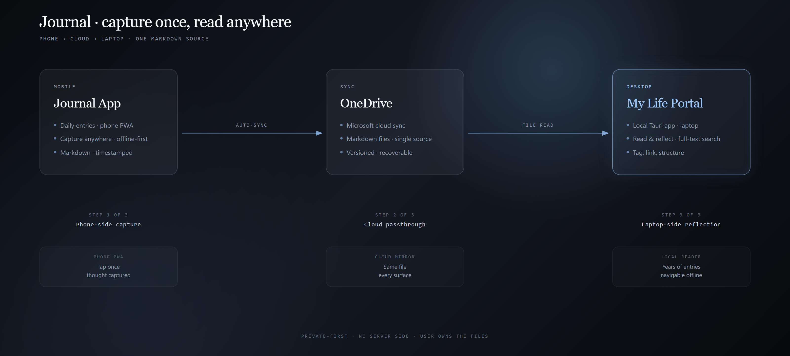
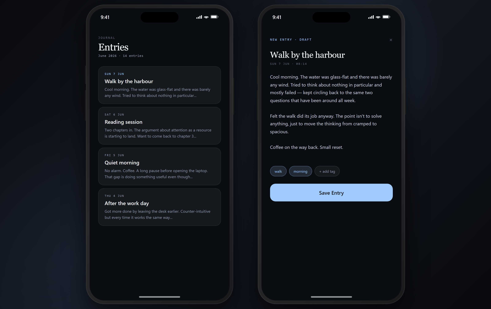

# Journal App

A private-first journaling and reflection system that turns daily capture into durable personal context.

> Sanitized public showcase. Approved public visuals: `assets/screenshots/journal-phone-capture.png` and `assets/diagrams/journal-bridge.png`.

## Why I built it

I have been journaling for about five years. I tried paper first, but it never really worked for me because the notebook had to be with me at the exact moment I wanted to write. Apple Notes worked better because it was always on my phone, but over time it became mostly one-way: capture something, then rarely come back to it. It was also one long note, which made it hard to find and reuse the thinking later.

So I built a small app specifically for capturing my thoughts. I open it and it is ready to write. Notes can sit in categories, and longer-running ideas can stay alive as things I return to and reshape. It also connects with my laptop app, My Life, so the thoughts I have captured over the years are easier to revisit, search, and use instead of disappearing into a pile of notes.

## The product problem

The product problem was simple: I already had the habit of writing, but I did not have a good loop for coming back. I needed something that would:

- open quickly on a phone;
- work even when connectivity is imperfect;
- separate quick journal entries from ideas that keep evolving;
- support categories without turning capture into admin;
- connect into my desktop reflection workflow;
- keep the raw record private while allowing safe public discussion of the system design.

## What it does

- **Journal capture:** write a quick daily note with optional tags and date adjustment.
- **Idea capture:** flip into idea mode when a note becomes something I may revisit and refine.
- **Simple scoring:** capture one lightweight daily signal without turning the app into a tracking spreadsheet.
- **History and editing:** revisit previous entries and continue shaping ideas.
- **Private-by-default storage:** store plain, portable files that can be indexed into my local desktop view.
- **Desktop connection:** make captured thoughts easier to revisit through My Life, rather than relying on memory or a single long note.
- **AI-assisted context, with limits:** create a structured foundation that future AI workflows can help summarize or retrieve, while keeping human oversight and privacy boundaries in place.

## What this demonstrates

This project is less about showing off a clever code trick and more about showing product judgement:

- identifying a real daily workflow pain;
- designing a low-friction capture loop;
- making privacy and portability part of the architecture, not an afterthought;
- using AI tools honestly to accelerate implementation, documentation, and iteration;
- testing, refining, and rejecting features that added friction without enough value.

## Architecture at a glance

The mobile app is a Svelte + Vite PWA. It keeps a local IndexedDB cache and queue for resilience, writes portable Markdown/YAML and JSON records through OneDrive, and connects to the My Life desktop projection layer for search, reflection, and future insight workflows.

See [`docs/architecture.md`](docs/architecture.md) for the public-safe architecture narrative.

## Architecture diagram

## Approved public screenshot

This is the only screenshot intentionally included in this public repository.

## Case study

See [`docs/case-study.md`](docs/case-study.md).

## Status

This repository is a sanitized public showcase. It explains the product pattern with synthetic examples and excludes private journal content, credentials, operational records, and production source code.

## AI-assisted builder note

I did not build this as an unaided solo coding exercise. I identified the problem, shaped the product direction, made trade-offs, guided AI/tooling through implementation and documentation, tested the working app, and refined it based on real use. That is the capability this showcase is meant to demonstrate.

## Read more

- **About the portfolio** — [www.mikhailnarbekov.com](https://www.mikhailnarbekov.com)
- **More projects** — [@Mnarbekov on GitHub](https://github.com/Mnarbekov)
